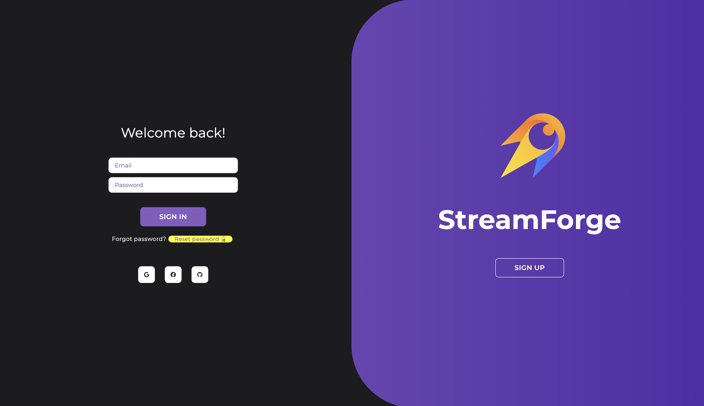
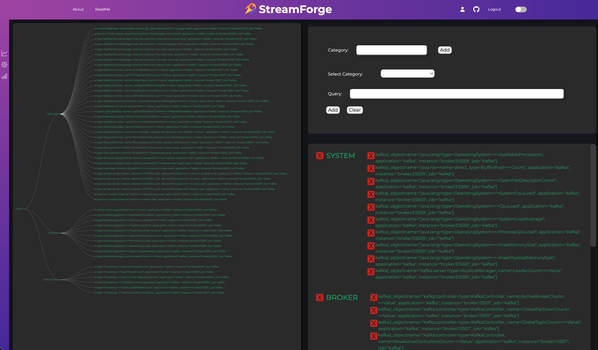

<div align ='center'>


</div>

# StreamForge

StreamForge is an advanced metrics monitoring dashboard specifically designed to help users easily visualize and track the health and performance of their Kafka clusters. Tailored for seamless integration with AWS MSK (Managed Streaming for Apache Kafka), StreamForge enables users to provide their unique Kafka cluster details and get up and running quickly with Prometheus configurations for efficient metrics scraping.

Managing and understanding Kafka clusters, especially in cloud environments like AWS MSK, can be challenging due to the complexity of setting up monitoring, managing large datasets, and interpreting intricate performance metrics. StreamForge simplifies this by offering a centralized, customizable, and user-friendly dashboard that gathers essential metrics and displays them in an intuitive, visually appealing format. By reducing configuration time and streamlining monitoring, StreamForge helps users make informed decisions about their Kafka infrastructure.

## Features


#### Secure Access 




Provides a highly secure login system utilizing OAuth, sessions, and JWT tokens for secure and compliant access.

<!-- #### Easy AWS MSK and Prometheus Integration -->


<!-- Offers streamlined configuration for connecting Kafka clusters, with guidance for setting up Prometheus to automatically scrape and process metrics. -->

#### Customizable Dashboard



 Users can add, delete, and modify categories based on their monitoring needs, ensuring a tailored view of their data.


#### AI Chat Support

Features an AI-powered chat that helps users with queries and guides them through optimizing their Kafka performance.


## Instructions

1. Initial setup instructions
2. Installation/configuration
```
# code block

```
3. Running the application 

4. Usage guidelines (how to use / gifs how to use main features )

5. Links to other documentation (docker docs, AWS ec2 , prometheus etc)


## Collaborate with StreamForge

StreamForge is an open-source product, welcoming collaboration from developers who want to contribute to advancing Kafka monitoring. Any contributions are always appreciated!

* Fork the repository
* Create your feature branch
* Create a pull request detailing the changes you would like to introduce


## License Information

This project is licensed under the MIT license- see the [LICENSE](./LICENSE) file for details

## Contributer Information


<div align="center" style="display: flex; justify-content: center; gap: 20px;">
<div align="center">
    <h6>Qianlin Zhang</h6>
    <br>
    <a href="https://github.com/QianQian1997">GitHub</a> |
    <a href="https://www.linkedin.com/in/qianlin-zhang-381972191/">LinkedIn</a>
</div>
<div align="center">
    <h6>David Schweitzer</h6>
    <br>
    <a href="https://github.com/DSchweitzer314">GitHub</a> |
    <a href="https://www.linkedin.com/in/david-schweitzer-b34768333/">LinkedIn</a>
</div>
<div align="center">
    <h6>Chenao Wang</h6>
    <br>
    <a href="https://github.com/chenaowang-debug">GitHub</a> |
    <a href="https://www.linkedin.com/in/chenao-wang-ab3b84ab/">LinkedIn</a>
</div>
<div align="center">
    <h6>Allie Itczak</h6>
    <br>
    <a href="https://github.com/aitczak">GitHub</a> |
    <a href="https://www.linkedin.com/in/allieitczak/">LinkedIn</a>
</div>
</div>
