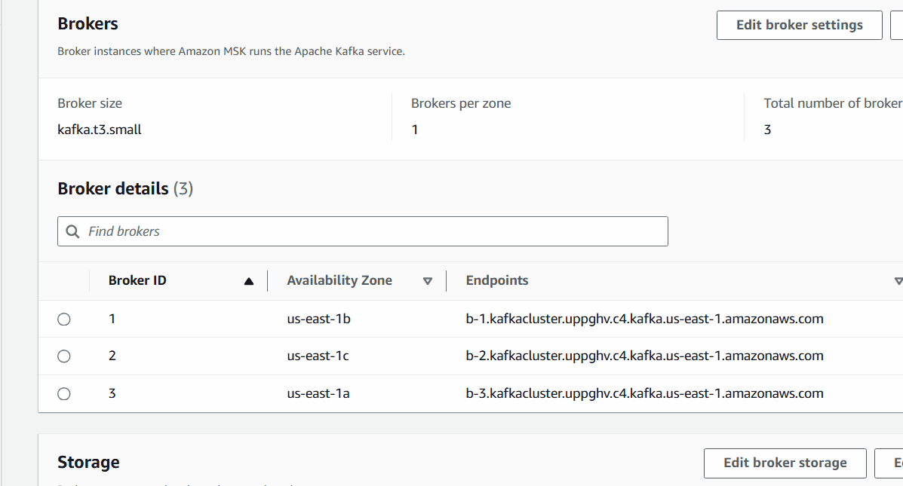

<div align ='center'>


</div>

# StreamForge

StreamForge is an advanced metrics monitoring dashboard specifically designed to help users easily visualize and track the health and performance of their Kafka clusters. Tailored for seamless integration with AWS MSK (Managed Streaming for Apache Kafka), StreamForge enables users to provide their unique Kafka cluster details and get up and running quickly with Prometheus configurations for efficient metrics scraping.

Managing and understanding Kafka clusters, especially in cloud environments like AWS MSK, can be challenging due to the complexity of setting up monitoring, managing large datasets, and interpreting intricate performance metrics. StreamForge simplifies this by offering a centralized, customizable, and user-friendly dashboard that gathers essential metrics and displays them in an intuitive, visually appealing format. By reducing configuration time and streamlining monitoring, StreamForge helps users make informed decisions about their Kafka infrastructure.

## Features


#### Secure Access 


Provides a highly secure login system utilizing OAuth, sessions, and JWT tokens for secure and compliant access.

<!-- #### Easy AWS MSK and Prometheus Integration -->


<!-- Offers streamlined configuration for connecting Kafka clusters, with guidance for setting up Prometheus to automatically scrape and process metrics. -->

#### Customizable Dashboard


 Users can add, delete, and modify categories based on their monitoring needs, ensuring a tailored view of their data.


#### AI Chat Support

Features an AI-powered chat that helps users with queries and guides them through optimizing their Kafka performance.


## Instructions

1. Initial setup instructions
2. Installation/configuration
  First make sure you have a prometheus service running for your Kafka cluster.
If you are using amazon's MSK(Managed Streaming for Kafka) you can set up a ec2 instance to accomplish this
# HOW TO CONNECT YOUR MSK CLUSTER TO PROMETHEUS
# Set up an ec2 service running prometheus
Create a ec2 instance in the same vpc as your desired MSK cluster

Make sure you give your ec2 instance the right IAM role to access your MSK cluster as well as a security group to allow communication between your ec2 instance and MSK Cluster
- Connect to your ec2 instance using SSH with your Keypair you created or one you already have
- Download Prometheus(select your desired version https://prometheus.io/download/) and copy the link and use the command ` wget https://github.com/prometheus/prometheus/releases/download/v2.53.2/prometheus-2.53.2.darwin-amd64.tar.gz ` replacing the link with your desired version.
- Next untar the file using the command ` tar xvfz prometheus-2.48.0.linux-amd64.tar.gz ` replacing the file name with the downloaded prometheus tar file.(use ls to see file name)
# Copy the Prometheus binary to /usr/local/bin
> sudo cp prometheus-2.48.0.linux-amd64/prometheus /usr/local/bin
# Copy promtool to /usr/local/bin/
> sudo cp prometheus-2.48.0.linux-amd64/promtool /usr/local/bin/
# Copy the consoles directory to /etc/prometheus
> sudo cp -r prometheus-2.48.0.linux-amd64/consoles /etc/prometheus
# Copy the 'console_libraries' directory to /etc/prometheus
> sudo cp -r prometheus-2.48.0.linux-amd64/console_libraries /etc/prometheus
> sudo cp prometheus-2.48.0.linux-amd64/promtool /usr/local/bin/
# Remove the Prometheus archive and extracted directory
> rm -rf prometheus-2.48.0.linux-amd64.tar.gz prometheus-2.48.0.linux-amd64
# Add the Prometheus YML file to configure how prometheus will scrape metrics
 We can do this by using either ` sudo nano /etc/prometheus/prometheus.yml ` or ` sudo vi /etc/prometheus/prometheus.yml `

here is an example config file for prometheus with two jobs for brockers on your msk cluster(Note you will want to enable monitoring for prometheus on your MSK cluster with JMX Exporter and Node Exporter)

your broker endpoint can be found in the properties tab of your MSK Cluster

```
global:
  scrape_interval: 15s
  external_labels:
    monitor: 'Kafka'
scrape_configs:
  - job_name: 'Broker1-JMX'
    static_configs:      
      - targets: ['{YOUR-BROKER-ENDPOINT}:11001']  
  - job_name: 'Broker1-NODE'
    static_configs:
      - targets: ['{YOUR-BROKER-ENDPOINT}:11002']
```
By default AWS MSK set's your JMX Exporter to expose to port 11001, and your Node Exporter to expose to port 11002

# Create the service in your instances systemd
To do this we will create a service file using the command sudo nano /etc/systemd/system/prometheus.service

Then copy this into the service file
```
[Unit]
Description=Prometheus
Wants=network-online.target
After=network-online.target

[Service]

User=prometheus
Group=prometheus
Type=simple
ExecStart=/usr/local/bin/prometheus \
    --config.file /etc/prometheus/prometheus.yml \
    --storage.tsdb.path /var/lib/prometheus/ \
    --web.console.templates=/etc/prometheus/consoles \
    --web.console.libraries=/etc/prometheus/console_libraries

[Install]
WantedBy=multi-user.target
```
Now save the file andwe will change the file permissions for the files we just created.
```
sudo chown prometheus:prometheus /etc/prometheus
sudo chown prometheus:prometheus /usr/local/bin/prometheus
sudo chown prometheus:prometheus /usr/local/bin/promtool
sudo chown -R prometheus:prometheus /etc/prometheus/consoles
sudo chown -R prometheus:prometheus /etc/prometheus/console_libraries
sudo chown -R prometheus:prometheus /var/lib/prometheus
```
Now all that is left to do is reload the system daemon then start our new service.
```
sudo systemctl daemon-reload
sudo systemctl start prometheus
```
Now we can check the status of the service using
> sudo systemctl status prometheus


If you want to see the metrics you are scraping from your broker simply go to the public address of your ec2 instance on port 9090
{YOUR_EC2_INSTANCE_PUBLICIPv4}:9090(You will use this address later to connect your prometheus to our web application.)

3. Running the application 

4. Usage guidelines (how to use / gifs how to use main features )

5. Links to other documentation (docker docs, AWS ec2 , prometheus etc)


## Collaborate with StreamForge

StreamForge is an open-source product, welcoming collaboration from developers who want to contribute to advancing Kafka monitoring. Any contributions are always appreciated!

* Fork the repository
* Create your feature branch
* Create a pull request detailing the changes you would like to introduce


## License Information

This project is licensed under the MIT license- see the [LICENSE](./LICENSE) file for details

## Contributer Information


<div align="center" style="display: flex; justify-content: center; gap: 20px;">
<div align="center">
    <h6>Qianlin Zhang</h6>
    <br>
    <a href="https://github.com/QianQian1997">GitHub</a> |
    <a href="https://www.linkedin.com/in/qianlin-zhang-381972191/">LinkedIn</a>
</div>
<div align="center">
    <h6>David Schweitzer</h6>
    <br>
    <a href="https://github.com/DSchweitzer314">GitHub</a> |
    <a href="https://www.linkedin.com/in/david-schweitzer-b34768333/">LinkedIn</a>
</div>
<div align="center">
    <h6>Chenao Wang</h6>
    <br>
    <a href="https://github.com/chenaowang-debug">GitHub</a> |
    <a href="https://www.linkedin.com/in/chenao-wang-ab3b84ab/">LinkedIn</a>
</div>
<div align="center">
    <h6>Allie Itczak</h6>
    <br>
    <a href="https://github.com/aitczak">GitHub</a> |
    <a href="https://www.linkedin.com/in/allieitczak/">LinkedIn</a>
</div>
</div>
